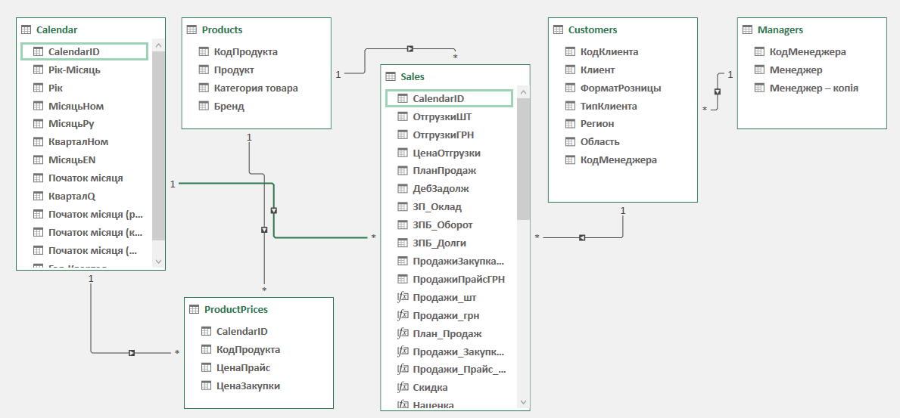
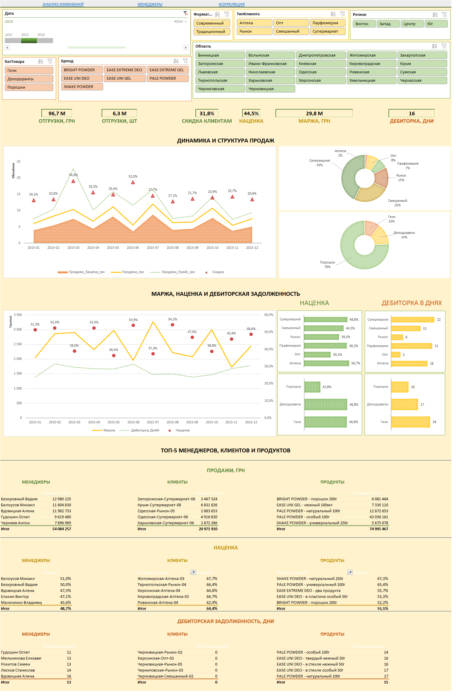
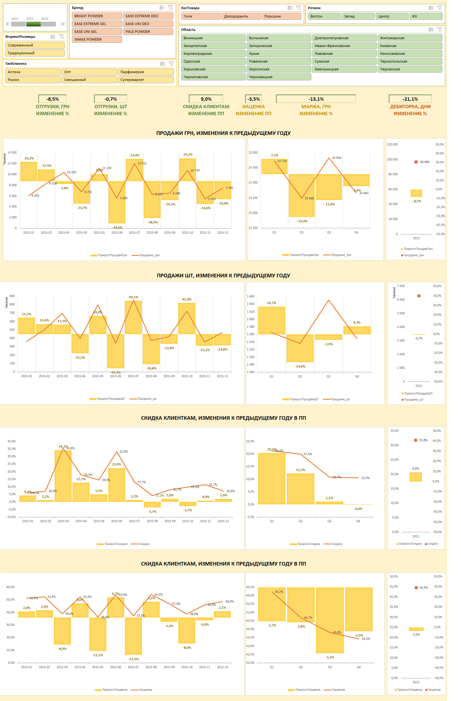
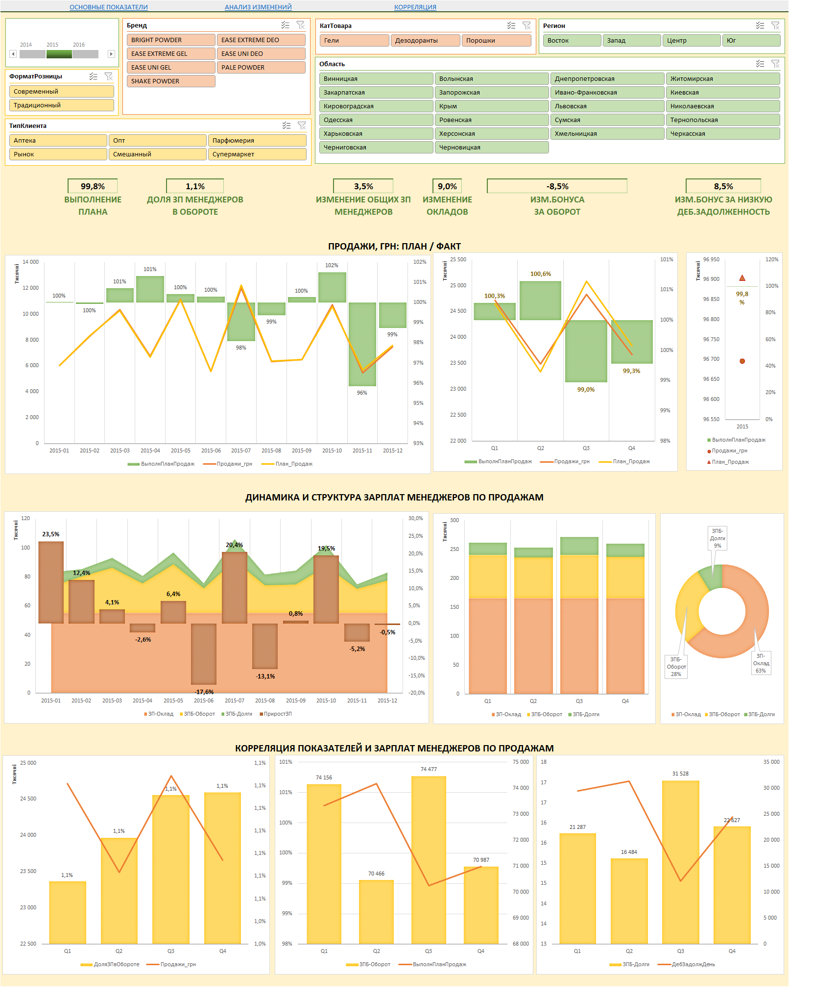
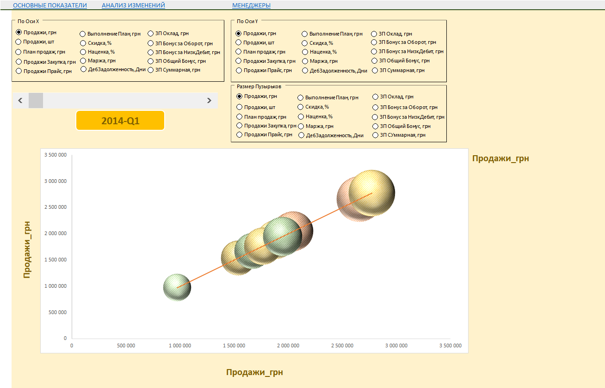

# 📈 Курсовий проєкт: MS Excel — Advanced

## 🔍 Опис проєкту

Цей курсовий проєкт — практична робота, яка систематизує навички з курсу «MS Excel: Просунуті інструменти». Мета — створення повноцінної системи бізнес-аналітики компанії, що включає:

- Підключення до зовнішніх джерел даних
- Очистку та трансформацію даних у Power Query
- Створення моделі даних із метриками в DAX
- Розробку 4-х інтерактивних дашбордів у Excel

## 🗂️ Джерела даних

Проєкт базується на роботі з реальними бізнес-даними, що зберігаються в різних форматах і папках:

- `DATA/ОтгрузкиКлиентам/` — дані про щомісячні відвантаження клієнтам
- `DATA/План_Продаж/` — щорічні плани продажів по менеджерах
- `DATA/ПрайсЛисты/` — прайс-листи по місяцях і роках
- `DATA/ДебиторскаяЗадолженность.csv` — заборгованість клієнтів
- `DATA/ЗарплатыМенеджеров.xlsx` — зарплати менеджерів
- `DATA/Клиенты.xlsx` — менеджери, регіони, типи клієнтів
- `DATA/Продукты_Закупка_Цена.xlsx` — закупівельні ціни на товари

## ⚙️ Етапи реалізації

### I. Обробка даних

- Очистка та уніфікація кодів клієнтів/товарів
- Перетворення багаторівневої структури в таблицю фактів
- Генерація календаря у Power Query
- Обчислення показників до найнижчого рівня: `місяць-продукт-клієнт`

### II. Побудова моделі даних

- Завантаження таблиць у Data Model
- Створення зв’язків між таблицями: календар, клієнти, продукти, менеджери
- Написання метрик у DAX:
  - Продажі (факт, план, прайс, закупка)
  - Знижки, націнка, маржа
  - Дебіторка у днях
  - Зарплата (оклад, бонуси)
  - Виконання плану та динаміка до попереднього року

### III. Дашборди (інформаційні панелі)

1. **Основні показники**
   - Продажі, націнка, дебіторка, топ-5: менеджери, продукти, клієнти
2. **Аналіз змін**
   - Порівняння з аналогічним періодом попереднього року
3. **Менеджери**
   - Зарплати, бонуси, ефективність
4. **Кореляція**
   - Пузирькова діаграма: вибір показників для аналізу взаємозв’язків

## 🎛 Інтерактивність

- Слайсери (роздільники), часові шкали (time slicers)
- Елементи керування формами для панелі кореляції
- Умовне форматування, динамічні підписи, масштабування показників
- Функції: `GETPIVOTDATA`, `OLAP`, `CALCULATE`, `SUMX`, `LOOKUPVALUE`, `AVERAGEX`

## 📸 Скріншоти

### 📊 Модель даних


### 📋 Дашборд 1: Основні показники


### 📈 Дашборд 2: Аналіз змін


### 👥 Дашборд 3: Менеджери


### 🔄 Дашборд 4: Кореляція


## 🧠 Навички, які відпрацьовуються

- Power Query: імпорт, трансформації, об’єднання даних
- Data Model: проєктування, зв’язки, оптимізація
- DAX: створення метрик, аналітика у часі, обробка помилок
- Побудова дашбордів: візуалізація, UX, взаємодія з користувачем

## 📁 Структура репозиторію

```
📁 DATA/                  # Папка з вхідними даними
📁 screenshots/           # Скриншоти дашбордів
📄 Excel_Advanced_Project.xlsx    # Основний Excel-файл
📄 README.md              # Документація
```

## ✅ Результат

Проєкт створює професійне рішення для аналітики бізнесу в Excel, з глибокою автоматизацією, гнучкими звітами та можливістю адаптації до нових даних.

## 📝 Авторка
[Вишневська Ірина]